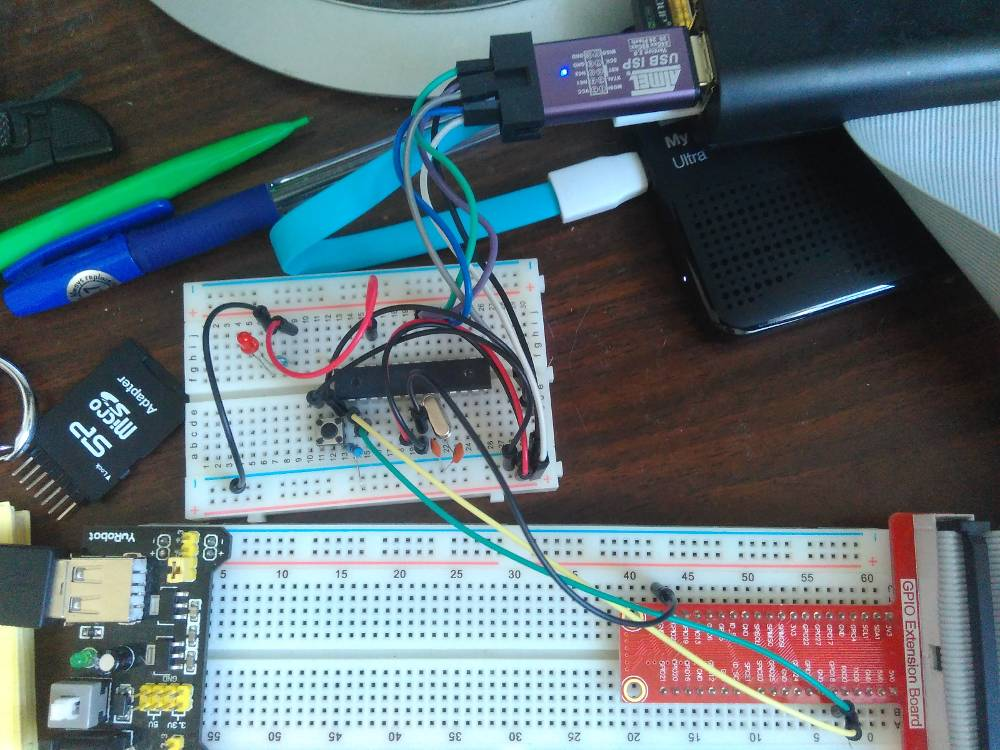

#Работа с микроконтроллером ATmega168 через ASP-программатор

*Необходимо обратить внимание, что в приведенных скриптах
и коммандах компиляции используется микроконтроллер с внешним кварцевым резонатор на 12 МГц*

## Установка необходимого ПО
Необходимый минимум программного обеспечения, которое нам понадобится:
* **gcc-avr** - это та часть мощной GNU Complier Collection (GCC), которая будет осуществлять кросс-компиляцию для целевой архитектуры микроконтроллеров AVR. GCC используется для сборки самого Linux, он поддерживает стандарты языка Си ISO C90 (ANSI-C), ISO C99, а также собственные расширения языка Си. GCC поддерживает огромное количество архитектур процессоров. Код, скомпилированный с помощью GCC для одной из платформ, потребует минимальных правок (или не потребует правок вообще) при компиляции для другой целевой платформы;
* **binutils-avr** - ассемблер, компоновщик и некоторые полезные утилиты;
* **avrdude** - утилита для работы с программаторами.

Также, для отладки пригодятся:
* **gdb-avr** - отладчик для AVR.
* **avarice** - интерфейс между avr-gdb и AVR JTAG ICE.
* **simulavr** - симулятор Atmel AVR.

> Установить одной коммандой  
` sudo apt-get install gcc-avr binutils-avr avr-libc avrdude gdb-avr avarice simulavr ` 

> После установки, просмотреть список установленных программ, можно коммандой: 
` ls /usr/bin | grep avr `

## Настройки ASP-программатора
Проверяем подключение:
> `$ lsusb |grep -i 16c0:05dc` 
`Bus 003 Device 006: ID 16c0:05dc VOTI shared ID for use with libusb`

Необходимо изменить доступ:
> `$sudo nano /etc/udev/rules.d/60-objdev.rules`

В открывшемся файле добавляем строку:
> ` ATTRS{idVendor}=="16c0", ATTRS{idProduct}=="05dc", GROUP="users", MODE="0666" `

Обновляем права
> `$sudo udevadm trigger`

Проверяем снова

> `avrdude: AVR device initialized and ready to accept instructions` 
`Reading | ################################################## | 100% 0.01s` 
`avrdude: Device signature = 0x1e9406` 
`avrdude: safemode: Fuses OK (E:01, H:DF, L:E6)` 
`avrdude done.  Thank you.` 

Программатор настроен.

## Запуск первой программы

Содержание и порядок компиляции можно посмотреть в исходниках,
ниже будет пример тестовой прошивки одной коммандой:

> `sh ./exec.sh`

В результате, сведодиод находящийся на регистре PC2 будет моргать с интервалом в 500мс.

## USART

Для пример взаимодействия по USART можно использовать прошивку в из файла **uart.c**.
Нижи, фото с распиновкой контактов:

> Важно помнить, что при любом взаимодействии между двумя устройствами
с разными источниками питаниями, всегда нужно замыкать землю между ними.