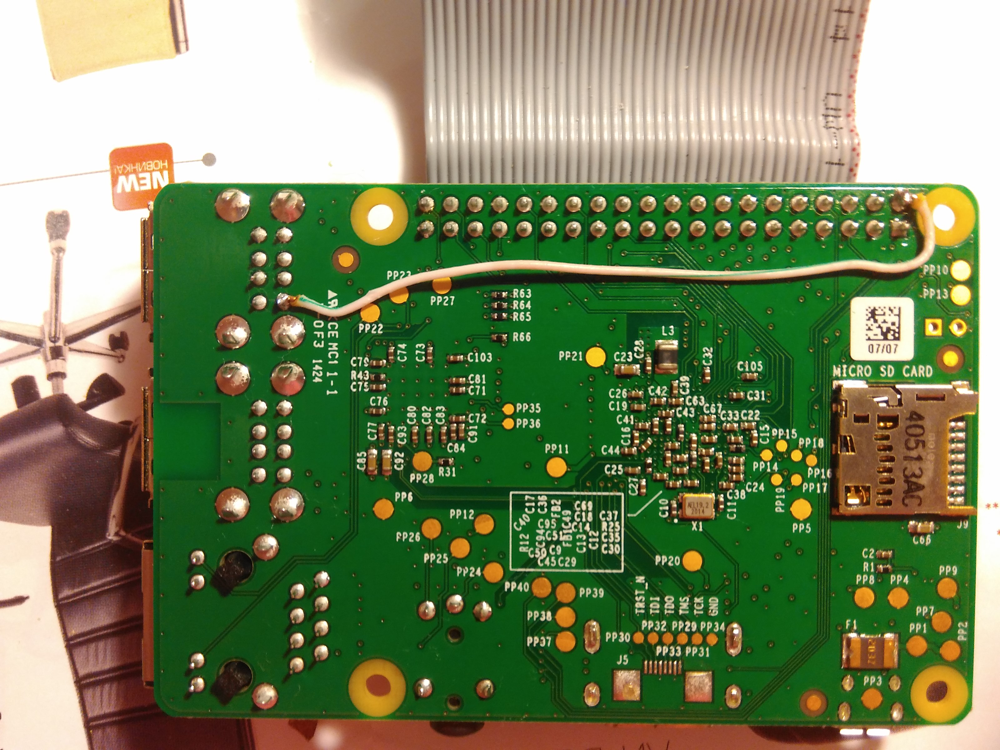

# Подключение и монтирование внешнего диска в RaspberryPi с Raspbian OS

## 1. Питание для диска
Все USB порты RasperryPi не являются самостоятельными, так как для их реализации
используется единый хаб. В связи с этим, для внешнего диска может не хватать питания.
Для решения данной задачи, можно подойти тремя путями:
1. Подключать внешниий диск с доп. проводом для питания.
1. Запитать саму плату Raspberry Pi (без паяльника).
1. Запитать USB порт от GPIO платы (метод с паяльником).

### Подключать внешниий диск с доп. проводом для питания
Данный способ самый простой. Изначально приобретается внешний диск с
дополнительным проводом, который питает диск из розетки.

> Бессмысленно подпитывать диск, подключив второй штекер в саму плату,
т.к. USB порты в RaspberryPi не являются самостоятельными.
 
### Запитать плату Raspberry Pi через USB 2.0 (без паяльника)
Данный способ превращает минусы USB-хаба в плюс. Т.к. подключив кабель с питанием
в один из выходов USB 2.0, одновременно можно запитать саму плату, спокойно выдернув
кабель из разъема, который планировался инженерами Raspberry.
Недостаток такого способа - свободных портов останется три.

### Запитать USB порт от GPIO платы (метод с паяльником)
Если нет нужды постоянно подпитывать какой либо модуль от GPIO, то можно
изпользовать один из портов для питания USB.

Положительная сторона в том, что USB порты запитываются лаконично, без лишних проводов.
Но для этого нужно поработать с паяльником.   

> Важно! При всех приведенных выше вариантах, питание должно быть НЕ от компьютера
или другого устройства, только из розетки. 

## 2. Установка настроек
Монтирование в Raspbian ничем не отличается от своего родителя Debian-овского.

Здесь, также три варианта решения:
### 1. Ручное монтирование
Объем материала на данный способ в интернете обильно, можно даже искать
на тему монтирования дисков в Debian. Положительным эффектом от данного способа
будет освоение матчасти.

### 2. Воспользоваться готовым решением
Установить демона и настроить его конфиги
> sudo apt-get install usbmount

> sudo nano /etc/ustmount/usbmount.conf

### 3. Cамописные скрипты
Пример, исходников лежит в этом репозитории.
Чтобы монтировать диск достаточно передать ему папку куда будем монтировать и,
чтото одно из двух, метку тома диска или UUID устройства.
> sudo sh mount.sh -d ~/моя\_папка\_диска -l myHard 

Чтобы размонитировать, достаточно указать что-то одно: папку монтировани,
UUID или метку диска (в последнем, диск должен быть подключен к плате).

> sudo sh unmount.sh -l myHard

## 3. Параметры скрипта
> Из скрипта-примера монтируется только файловая система в ext4

**-d|--dir** Путь куда будет монтироваться внешний диск, если директории
не существует, то она будет создана

**-l|--label** Метка тома диска. Наиболее удобна, чем UUID

**-u|--uuid** Идентификатор внешнего диска, узнать можно коммандой `sudo blkid`